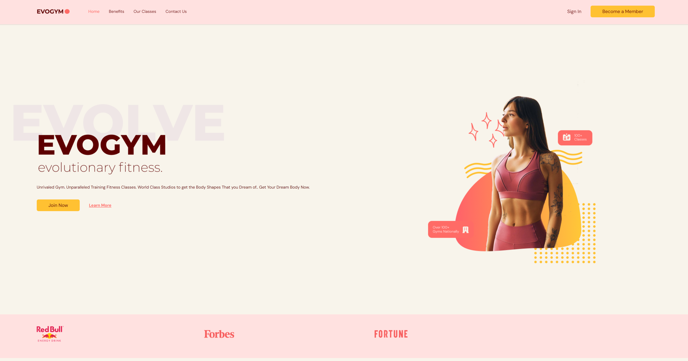

# Evogym

It's a fitness landing page.

## How to Use

1. Clone the repository.
2. Navigate to the project directory.
3. Install the dependencies.
4. Run `npm run dev`.

## Technologies

- React.
- Typescript.

## Project Images

